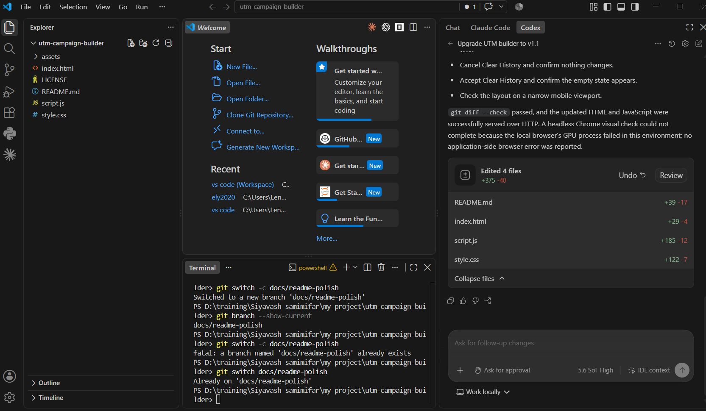
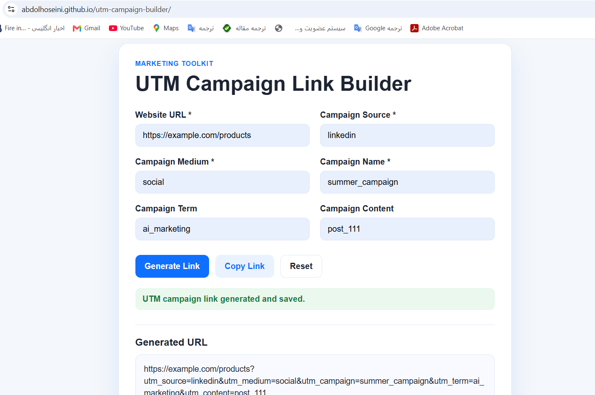

# UTM Campaign Link Builder

A responsive, browser-based tool for creating consistent, trackable marketing URLs with UTM parameters.

**[View the live demo](https://abdolhoseini.github.io/utm-campaign-builder/)**



## Purpose

Marketing links often need campaign details added by hand. This can lead to missing parameters, inconsistent naming, and incorrectly formatted URLs that make traffic attribution harder.

UTM Campaign Link Builder validates the destination URL, adds the campaign parameters safely, and preserves existing query parameters. It creates links that analytics platforms can recognize, but it does **not** collect, process, or report analytics itself.

## Features

- Validates website URLs and required campaign fields
- Preserves existing URL query parameters
- Generates correctly encoded UTM campaign links
- Copies generated and previously saved links to the clipboard
- Stores unique campaign history locally in the browser
- Searches history by campaign name, source, or medium
- Deletes individual campaigns or clears all history after confirmation
- Exports the complete campaign history as a correctly escaped CSV file
- Prevents duplicate history records for the same generated URL
- Provides a responsive layout and accessible form labels

## Campaign History

Every successfully generated campaign is saved in browser `localStorage` and displayed newest first. Each record contains the original website URL, all UTM values, the generated URL, and its creation date and time. History remains available after refreshing the page unless browser storage is cleared.



## UTM Parameters

| Parameter | Purpose | Example |
| --- | --- | --- |
| `utm_source` | Identifies where traffic originated | `google`, `newsletter` |
| `utm_medium` | Identifies the marketing channel | `cpc`, `email` |
| `utm_campaign` | Identifies the campaign | `spring_sale_2026` |
| `utm_term` | Optionally identifies a keyword | `running_shoes` |
| `utm_content` | Optionally distinguishes content or ads | `blue_banner` |

## Technology Stack

- Semantic HTML5
- CSS3 with responsive layouts
- Vanilla JavaScript
- Browser `URL`, `URLSearchParams`, Clipboard, `localStorage`, Blob, and download APIs

No frameworks, third-party packages, backend, database, or external APIs are used.

## Privacy

Campaign history stays on the user's device in browser `localStorage`. The application does not transmit campaign data or collect analytics. Saved history is specific to the current browser and site origin, does not sync between devices, and can be removed through Clear History or the browser's storage settings.

## How to Run Locally

Clone or download the project, then either open `index.html` directly or serve the folder with a local static server:

```bash
python -m http.server 8000
```

Open `http://localhost:8000` in a browser.

## Manual Testing

1. Submit empty required fields and confirm the validation messages appear.
2. Test invalid URLs and valid `http://` or `https://` URLs.
3. Generate a link from a URL that already has query parameters and confirm they remain.
4. Confirm required and optional UTM parameters are encoded correctly.
5. Generate the same link twice and confirm only one history record exists.
6. Refresh the page and confirm campaign history remains available.
7. Search by campaign name, source, and medium.
8. Test generated-link copy, history copy, individual delete, CSV export, and clear-history confirmation.
9. Check the layout on desktop and mobile screen sizes.

## Future Improvements

- Optional CSV import and history backup
- Additional campaign naming guidance
- Support for more advanced tracking fields
- Dark mode

## License

This project is available under the terms in the [LICENSE](LICENSE) file.
